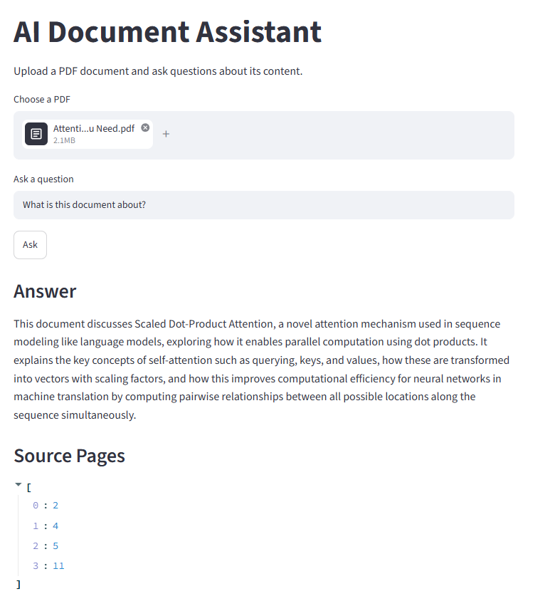
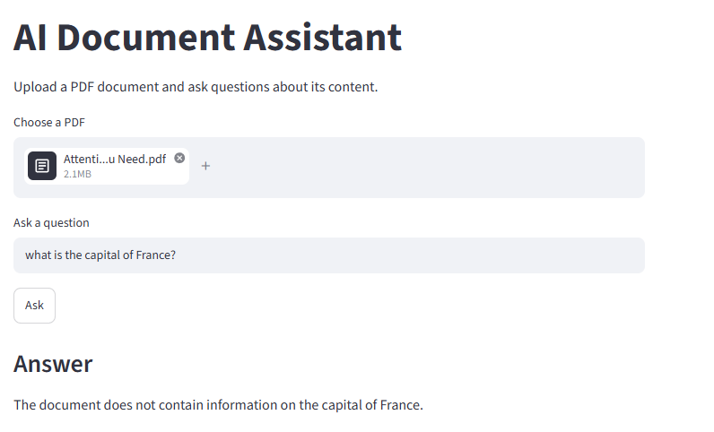

# AI Document Assistant

A modular Retrieval-Augmented Generation (RAG) application built with FastAPI and Streamlit for document question answering using interchangeable Large Language Model (LLM) providers.

---

## User Interface

### Example
#### Question about the document



#### Question outside the document



---
## Architecture

```text
Streamlit UI
                       │
                 HTTP Requests
                       │
                 FastAPI Backend
                       │
                PDF Upload Endpoint
                       │
               PDF Text Extraction
                       │
                  Text Chunking
                       │
                  Embedding Model
                       │
              Semantic Retrieval
                       │
                 Context Builder
                       │
                Provider Factory
                 ┌────────┴────────┐
                 │                 │
             Ollama           OpenAI
                 │
                 ▼
               Response
```

---
## Key Features
- Retrieval-Augmented Generation (RAG)
- Modular provider architecture
- Local inference with Ollama
- Optional OpenAI integration
- Semantic search using embeddings
- FastAPI backend
- Streamlit frontend
- Unit-tested components

## Features

The first version includes:

* PDF upload through a FastAPI endpoint
* PDF text extraction with `pypdf`
* Automatic document chunking
* Semantic retrieval with cosine similarity
* Retrieval-Augmented Generation (RAG)
* Configurable LLM providers
* Streamlit web interface
* Source page references
* Automated tests with pytest

> The current parser supports PDFs that already contain selectable text.
> Scanned documents will require OCR in a later version.

---

## LLM Providers

The application uses a provider abstraction, making it easy to switch between
different Large Language Models without changing the API layer.

This approach allows the application to support both cloud-hosted and locally
hosted models while keeping the rest of the codebase unchanged.

The current implementation includes:

- **Mock Provider** – A deterministic implementation used for development and testing without requiring an API key.
- **OpenAI Provider** – Uses the OpenAI Responses API to generate answers based on the uploaded document. Requires a valid OpenAI API key and an OpenAI Platform account with active billing or available API credits.
- **Ollama Provider** – Runs a local LLM without requiring an API key or external service, making the project easier to run, test and extend.

The active provider is selected through the `LLM_PROVIDER` environment
variable. This allows switching between mock, OpenAI, and Ollama without
modifying the application code.

Future providers may include Hugging Face or Azure OpenAI.

---

## Project structure
The project follows a layered architecture to separate the API layer, business logic, and LLM providers.

```text
.
├── app/
│   ├── main.py
│   ├── models.py
│   ├── schemas.py
│   ├── providers/
│   ├──── embeddings/
│   │     ├── factory.py
│   │     ├── base.py
│   │     └── ollama_provider.py
│   │   ├── base.py
│   │   ├── factory.py
│   │   ├── mock_provider.py
│   │   ├── openai_provider.py
│   │   └── ollama_provider.py
│   └── services/
│       ├── document_store.py
│       ├── pdf_parser.py
│       ├── retrieval.py
│       └── text_chunker.py
│
├── ui/
│   └── streamlit_app.py
│
├── tests/
│   ├── test_api.py
│   ├── test_document_store.py
│   ├── test_embedding_service.py
│   ├── test_health.py
│   ├── test_pdf_parser.py
│   ├── test_retrieval.py
│   └── test_text_chunker.py
│
├── requirements.txt
├── pytest.ini
├── .env.example
└── README.md
```

---

## RAG Pipeline

Each uploaded document follows the following processing pipeline:

```text
PDF
 │
 ▼
Text Extraction
 │
 ▼
Chunking
 │
 ▼
Embeddings
 │
 ▼
Semantic Retrieval
 │
 ▼
Relevant Context
 │
 ▼
LLM (Ollama / OpenAI)
 │
 ▼
Answer + Source Pages
```

Instead of sending the entire document to the language model, only the most relevant chunks are retrieved and supplied as context. This reduces hallucinations, improves scalability, and enables more accurate document question answering.

---

## Setup

### 1. Create a virtual environment

Windows

```bash
py -m venv .venv
.venv\Scripts\activate
```

macOS / Linux

```bash
python -m venv .venv
source .venv/bin/activate
```

### 2. Install dependencies

```bash
pip install -r requirements.txt
```

### 3. Configure environment variables

Copy `.env.example` to `.env` and replace the placeholder values with your own configuration.


> **Note**
>
> 
> 
> The OpenAI provider requires a valid OpenAI API key and an OpenAI Platform account with  active billing or available API credits.
> 
> The Ollama Provider requires Ollama to be installed locally together with the selected model (e.g. gemma3:1b).
>
> The .env file contains sensitive information and should never be committed to Git.
> 

### 4. Run the API

```bash
python -m uvicorn app.main:app --reload
```

Open the interactive API documentation:

```text
http://127.0.0.1:8000/docs
```
---

### 5. Launch the Streamlit interface

In a second terminal:

```bash
python -m streamlit run ui/streamlit_app.py
```
The application will be available at:

```text
http://localhost:8501
```
---

## First test

1. Upload a PDF using `POST /documents`.
2. Copy the returned `document_id`.
3. Call `POST /ask`:

```json
{
  "document_id": "paste-the-id-here",
  "question": "What is this document about?"
}
```

Depending on the selected provider, the application generates answers using either:

- Ollama (local inference)
- OpenAI (cloud inference)
- Mock Provider (development and testing)

---

## Testing

The project includes automated tests using `pytest`.

Current test coverage includes:

- API endpoints
- Health endpoint
- PDF parser
- Document store
- Text chunking
- Embedding provider
- Semantic retrieval

Run all tests with:

```bash
python -m pytest -v
```
---

## Next milestones
The project is being developed incrementally.

Planned improvements include:
* FAISS or ChromaDB vector database
* Conversation memory
* Database persistence
* OCR support for scanned PDFs
* Docker support
